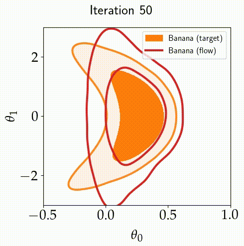

# `emuflow`: Normalizing Flows for Joint Cosmological Analysis

<div style="text-align: center;">
    
</div>

## Create an environment

Assuming we have `anaconda3` installed.

1. Create an environment

```
conda create --name emuflow python=3.9
```

1. Install `PyTorch` based on your hardware (CPU/GPU) using the instructions found <a href="https://pytorch.org/get-started/locally">here</a>.

2. Install the packages found in the `requirements.txt` file:

```
pip install -r requirements.txt
```

In part of the analysis, we have also use `JAX-COSMO` and we have used the following to install `jax`:

```
pip install jaxlib==0.3.25+cuda11.cudnn82 -f https://storage.googleapis.com/jax-releases/jax_cuda_releases.html
pip install jax[gpu]==0.3.25 -f https://storage.googleapis.com/jax-releases/jax_releases.html
```

## Steps towards the Joint Analysis

We describe briefly the steps towards doing the joint analysis.

### Step 1 - Process your data

<div align="justify">

The first step is to post-process our MCMC chains so that we retain only the following columns.

$$
\left[\sigma_{8},\,\Omega_{c},\,\Omega_{b},\,h,\,n_{s}\right]
$$

Note that we need $\Omega_{c}$ and $\Omega_{b}$ without the $h^{2}$ factor. Sometimes, $\Omega_{c}h^{2}$ and $\Omega_{b}h^{2}$ are stored in public MCMC chains. A few examples of how we process the chains are shown in the notebook `processing.ipynb`. The processed samples will be stored in the folder `samples/`.

</div>

### Step 2 - Create a config file for your experiment

The next step is to create a config file for our experiment in the folder `conf/experiment/` and we need to specify the following

```yaml
fname: name of the processed file in the folder samples/
nsamples: number of training points
lr: 1.0e-3
nsteps: 3000

plot:
  genplot: True
  nfsamples: 50000
  label1: name of the experiment, for example, DES Y3
  label2: name of the experiment and flow, for example, DES Y3 (Flow)
```

<div align="justify">

Feel free to adjust the learning rate (`lr`) and the number of training points (`nsamples`) to be used. If `nsamples` is set to `null`, all the samples stored in the `samples/` folder will be used. For a 5D problem, 15000 training points should be sufficient. It can also be the case that we have fewer than 15000 samples available (for example, in the case where multinest or polychord has been used to sample the posterior). In this case, our recommendation is to set `nsamples=null`.

</div>

### Step 3 - Train your Normalizing Flow(s)

<div align="justify">
Once the above is completed, we are now ready to train our normalizing flow, which can be achieved using:

```
python train.py --config-name=base_plikHM_TTTEEE_lowl_lowE nsteps=3000 lr=5.0e-3 nsamples=20000
```

The above example trains a normalizing flow for the public Planck chain using:

- 3000 iterations (in the optimisation)
- a learning rate of `5.0e-3`
- 20000 training points.

The outputs of the training procedure are stored in the folder `outputs/`, followed by today's date, for example, `2024-06-10/` (year, month day), followed by the time at which the training has been done, for example, `11-45-53/` (hour, minutes, seconds). The full path to the training outputs is then:

```
outputs/2024-06-10/11-45-53/
```

In that folder, we have the loss curve. If it is oscilatory, our recommendation is to lower the learning rate. We also have a triangle plot showing the 1D and 2D distributions of the original samples and the samples generated by the normalizing flow. If we are happy with the triangle plot (and the loss curve), then the file `fname.pt` should be copied to the `flows/` folder (found in the parent directory).

Training a single flow model with 20000 training points should take $\sim 3$ minutes.

_Multi-run Training_

If we want, it is also possible to a have a multi-run experiment (training the flow model for different configurations). This is achieved using:

```
python train.py -m --config-name=base_plikHM_TTTEEE_lowl_lowE nsteps=3000,4000 lr=1.0e-3,5.0e-3 nsamples=20000
```

In this case, the outputs will be found in the folder:

```
multirun/2024-06-10/11-45-53/0/
multirun/2024-06-10/11-45-53/1/
multirun/2024-06-10/11-45-53/2/
multirun/2024-06-10/11-45-53/3/
```

that is, we have 4 folders because we have 4 combinations.

</div>

### Step 4 - Perform the Joint Analysis

<div align="justify">

The last step is to perform the joint analysis. Suppose, we have the flows, `experiement_1.pt` and `experiment_2.pt` trained and stored in the `flows/` folder. We can now run the following to sample the joint posterior:

```
python main.py nmcmc=10000 joints=[experiment_1,experiment_2] mcmc_fname=experiment_1_2
```

where `nmcmc` is the number of samples we want per walker. We are using `emcee` internally. Hence, it will generate a total of $N_{mcmc}\times 10$ samples (10 because we have $D=5$, that is, 5 dimensions, and by default at least 2D walkers are required by `emcee`).

`mcmc_fname` is the name of the MCMC file for the joint posterior.

The results are stored in the `output/` folder (dated and timed). After analysing the chain, if we are happy with it, it is better to then move it to the `mcmcsamples/` folder found in the parent directory.

Sampling the joint of 2 experiments takes around 13 minutes. If we choose 3 experiments, this takes around 20 minutes.

_Multi-run Sampling_

As above, it is also possible to launch sampling with different configurations. For example,

```
python main.py nmcmc=5000,10000 joints=[experiment_1,experiment_2] mcmc_fname=experiment_1_2
```

and the results will be stored in the `multirun/` folder.

</div>

# Using the flow as a prior

<div align="justify">

Because we also have a normalized density (the flow model), it is also possible to use it as prior if we want to in any cosmological analysis. To do so, we can use the following:

```python
import numpy as np
import torch
from src.flow import NormFlow

def load_flow(experiment: str) -> NormFlow:
    """Load a pre-trained normalising flow.

    Args:
        experiment (str): name of the experiment (flow)

    Returns:
        NormFlow: the pre-trained normalising flow
    """
    fullpath = f"flows/{experiment}.pt"
    flow = torch.load(fullpath)
    return flow

flow = load_flow('base_plikHM_TTTEEE_lowl_lowE')
cosmology = np.array([0.805, 0.245, 0.048, 0.686, 0.976])
log_density = flow.loglike(cosmology).item()
```

</div>

# Public Likelihoods and MCMC chains

<div align="justify">
We also have a series of pre-trained normalising flows available. Some of them are listed below:

### Planck 2018

We use the `base_plikHM_TTTEEE_lowl_lowE` MCMC samples, which are available [here](https://pla.esac.esa.int/pla/aio/product-action?COSMOLOGY.FILE_ID=COM_CosmoParams_base-plikHM-TTTEEE-lowl-lowE_R3.00.zip) ([Planck collaboration et al. 2020](http://dx.doi.org/10.1051/0004-6361/201833910)).

### DES Y3

This is a $3\times 2$ point $\Lambda$CDM analysis with fixed neutrino mass ([Abbott et al. 2022](https://journals.aps.org/prd/abstract/10.1103/PhysRevD.105.023520)). The chain is available [here](http://desdr-server.ncsa.illinois.edu/despublic/y3a2_files/chains/chain_3x2pt_fixednu_lcdm.txt).

### KiDS-1000

In this case, we have different chains due to different analyses performed. The normalising flows are built on top of the MCMC samples where the following data vectors

- Band powers
- Correlation functions
- COSEBI

which were used by [Asgari et al. (2021)](https://doi.org/10.1051/0004-6361/202039070) and are available [here](https://kids.strw.leidenuniv.nl/DR4/data_files/KiDS1000_cosmic_shear_data_release.tgz).

We also have the chains from

- [Heymans et al. 2021](https://doi.org/10.1051/0004-6361/202039063), which uses spectroscopic data in a joint analysis with cosmic shear. The MCMC samples are available [here](https://kids.strw.leidenuniv.nl/DR4/data_files/KiDS1000_3x2pt_fiducial_chains.tar.gz).
- a hybrid analysis performed by [Dark Energy Survey and Kilo-Degree Survey Collaboration et al. (2023)](https://doi.org/10.21105/astro.2305.17173), which uses DES Y3 ([samples](https://desdr-server.ncsa.illinois.edu/despublic/y3a2_files/y3a2_joint-des-kids/chains/chain_desy3_hybrid_analysis.txt)) and KiDS-1000 ([samples](https://desdr-server.ncsa.illinois.edu/despublic/y3a2_files/y3a2_joint-des-kids/chains/chain_kids1000_hybrid_analysis.txt)) data.

### ACT

The samples correspond to [constraints from ACT DR4 TT+TE+EE (LCDM)](https://lambda.gsfc.nasa.gov/data/suborbital/ACT/mcmc_hills_2021/CLASS2p8_ACTPol_lite_DR4_leakfix_yp2_baseLCDM_taup_hip_R0p01.tgz).

### SDSS (BAO)

We built two normalising flow models based on:

- CMB+BAO [samples](https://svn.sdss.org/public/data/eboss/DR16cosmo/tags/v1_0_1/mcmc/base/CMB_BAO/)
- CMB+BAO+SN [samples](https://svn.sdss.org/public/data/eboss/DR16cosmo/tags/v1_0_1/mcmc/base/CMB_BAO_SN/)
</div>

# Joint Sampling of DES Y1 and Planck

<div align="justify">

This is just for sampling the Planck likelihood.

```
python sampleplanck.py nsamples=5 output_name=plancktest
```

We can use the following for sampling the DES Y1 and Planck likelihood.

```
python sampledesplanck.py nsamples=5 output_name=desplancktest useflow=False
```

In the latter, if we want to use a pre-trained normalising flow, we should specify the following in the `conf/desy1planck.yaml` file:

```
flow_name: base_plikHM_TTTEEE_lowl_lowE (or planck_lite)
useflow: True
```

With the flow, the calculation of the total likelihood will be faster.

```
python sampledesplanck.py nsamples=5 output_name=desplancktestflow useflow=True flow_name=base_plikHM_TTTEEE_lowl_lowE
```

</div>
